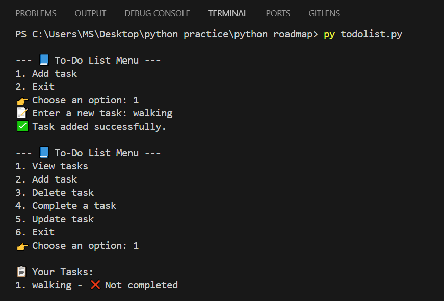

# 📝 To-Do List CLI Application

This is a simple Python-based Command Line Interface (CLI) tool for managing a To-Do List.  
You can **Add**, **View**, **Update**, **Delete**, and **Mark tasks as Completed** easily through the terminal.

---

## 🚀 Features
- View all tasks
- Add a new task
- Delete a task
- Mark a task as completed
- Update a task description
- Exit the application

---

## 🛠 How to Run the Application

1. Make sure you have **Python 3** installed.
2. Clone this repository or download the code.
3. Open your terminal/command prompt in the project folder.
4. Run the following command:

python todolist.py

# 📋 How to Use the To-Do List CLI Application

Now we explain how to use the To-Do List CLI tool, how to run it, and shows an example screenshot.

---

## 🛠 How to Run the Program

1. Open your terminal or command prompt.
2. Navigate to the project folder:

python todolist.py

--- To-Do List ---
1. Add task
2. Exit

