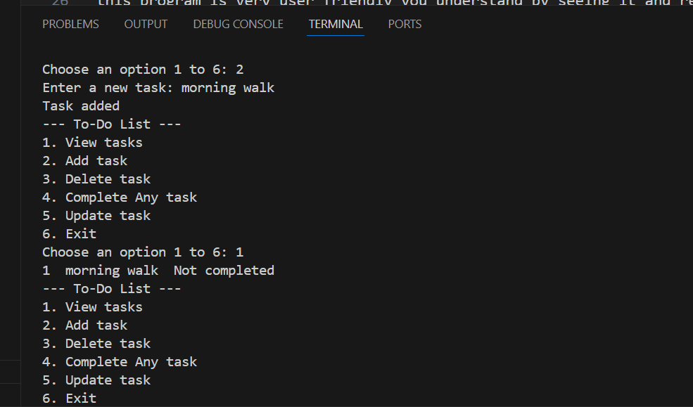

# 📋 How to Use the To-Do List CLI Application

This document explains how to use the To-Do List CLI tool, how to run it, and shows an example screenshot.

---

## 🛠 How to Run the Program

1. Open your terminal or command prompt.
2. Navigate to the project folder:

python todolist.py

--- To-Do List ---
1. View tasks
2. Add task
3. Delete task
4. Complete Any task
5. Update task
6. Exit

Next you can chose any option according to your need 
Like write 1 and Press Enter you can view all task you added before and
this program is very user friendly you understand by seeing it and reading it 

if you write 2 and press enter it show this
Enter your new Task : 
then you write some thing like  
Enter your new Task : morining walk 
it look like this 
